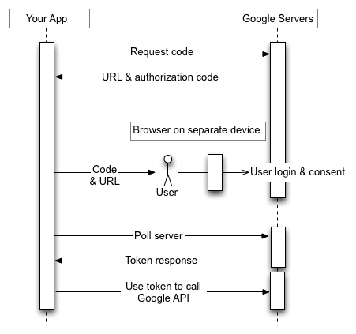
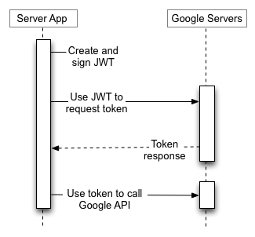

# 使用 OAuth 2.0 来访问谷歌 API

* 目录
* 基本步骤
*	Web 服务器应用程序
*	本地安装的应用程序
*	客户端方面（JavaScript）应用程序
*	在输入有限的设备上的应用程序
*	服务账户
* 令牌有效期限
* 客户端库

谷歌 APIs 使用 [OAuth 2.0 协议](http://tools.ietf.org/html/rfc6749)来进行验证和授权。谷歌支持常见的 OAuth 2.0 方案，例如 web 服务器使用的，本地安装的，和客户端方面的应用。

首先，从[谷歌开发者控制台](https://console.developers.google.com/)获得 OAuth 2.0 客户端凭证。然后您的客户端应用程序向谷歌授权服务器请求获得一个访问令牌，接下来从回应中提取出令牌，并将其发送给你想要访问的谷歌 API。
若想动手演练如何通过 OAuth 2.0 访问谷歌，您可以在 [OAuth 2.0 游乐场](https://developers.google.com/oauthplayground/)里面做实验（您可以选择使用自己的客户端凭证）。

该页面为您概要地展示各种谷歌支持的 OAuth 2.0 授权方案，并提供详细内容的链接。若想详细了解关于如何使用 OAuth 2.0 来进行验证，请参阅 [OpenID 连接](https://developers.google.com/identity/protocols/OpenIDConnect)。

> 注意：由于能否正确实现该功能牵涉到安全问题，所以当您和谷歌的 OAuth 2.0 端点进行互动时，我们强烈建议您使用 OAuth 2.0 库。使用他人经过良好除错的代码是一项最佳实践，这样做能有助于保护您自己和您的用户。更多信息请参阅客户端库。

## 内容

## 基本步骤

所有应用程序在通过 OAuth 2.0 访问谷歌 API 时都遵循一个基本模式。抽象地说，你需要遵循下面四步:

**1. 从谷歌开发者控制台获得 OAuth 2.0 凭证。**

访问[谷歌开发者控制台](https://console.developers.google.com/)来获得 OAuth 2.0 凭证，例如应用程序和谷歌都知道的一个客户端 ID 和客户端 secret。数据集会根据你所建立的应用程序类型而有所不同，举例来说，一个 JavaScript 应用程序并不要求一个 secret，但是一个 web 服务器应用程序就会要求。

**2. 从谷歌授权服务器获得一个访问密钥。**

在你的应用程序可以通过谷歌 API 访问私有数据之前，它必须获得一个访问令牌来许可你访问那个 API。一个单独的访问令牌可以为多个 API 许可不同程度的访问权限。一个叫做 `scope`（域）的变量参数可用来控制一个访问令牌所许可的控制资源集和操作集。在一个有访问令牌的请求中，你的应用程序可发送一个或多个 `scope` 参数。

有多种方法可以发出这个请求，这些方法根据你所创建的应用程序类型不同而有所不同。举例来说，一个 JavaScript 应用程序可以通过浏览器重定向到谷歌要求访问令牌，而安装在一个没有浏览器的设备上的应用程序则会使用 web 服务请求。

一些请求会要求用户登陆到他们的谷歌账户作为一个验证步骤。登陆之后，用户会被询问他们是否愿意许可你的应用程序所要求的权限。这个过程叫做“用户准许”（user consent）。

如果用户批准了请求，谷歌授权服务器会发送一个访问令牌给您的应用程序（或一个应用程序可以使用的授权码来获得访问令牌）。如果用户没有批准请求，服务器会返回一个错误信息。

通常来说渐进地要求各种 scope 是一项最佳实践，比起一次性要求所有权限，当需要进行这种访问时才发出相应的请求会更好。
举例来说，一个想要支持购买功能的应用程序不应该在用户点击“购买”按钮之前要求谷歌钱包访问权; 详情参阅[渐进式授权](https://developers.google.com/accounts/docs/OAuth2WebServer#incrementalAuth)。

**3. 发送访问令牌给一个 API。**

当一个应用程序获取访问令牌时，会在一个 HTTP 授权头里嵌入令牌发送给谷歌 API。当然，以 URI 查询串参数来发送令牌也是可行的，但我们不推荐这样做，因为 URI 参数会在 log 中留下痕迹，而 log 本身并不是十分安全。同时，避免创建不必要的 URI 参数名是一项 REST 良好实践。

访问令牌仅对令牌所请求的 `scope` 中有描述的操作集和资源集有效。举例来说，如果一个用于Google+ API 的访问令牌被分发下来，这个令牌并不能许可您访问谷歌通讯录 API。然而，你可以，将那个访问令牌多次发送给谷歌+ 来实现相似操作。

**4. 刷新访问令牌，如果必要的话。**

访问令牌的生命期是有限的。如果你的应用程序需要比一个访问令牌的生命期更长的时间来访问谷歌 API，可以通过获得一个刷新令牌(refresh token)来实现。刷新令牌可以让您的应用程序获得新的访问令牌。

> 注意: 将刷新令牌保存在一个安全的长期存储器内并持续地使用他们直到令牌过期。每对客户端-用户能获得的刷新令牌的数量是有限的，同一个用户在多个客户端上能获得的刷新令牌也是有限的，而且这些限制都不一样。如果你的应用程序请求的刷新令牌数量超过上述的任何一个限制，限制外较旧的刷新令牌会自动失效。

## 方案

### web 服务器应用程序

谷歌 OAuth 2.0 端点支持使用下列语言和框架编写的web 服务器应用程序：PHP，Java，Python，Ruby，和 ASP.NET。

授权程序会在您的应用程序将浏览器重定向到谷歌 URL 时启动; URL 包含了查询参数来指出请求的访问类型。谷歌 负责用户验证，会话选择，和用户准许。这一程序的结果是授权码，应用程序可以通过这个码来获得一个访问令牌和一个刷新令牌。

应用程序应存储刷新令牌供未来使用，并使用访问令牌来访问谷歌 API。一旦访问令牌过期，应用程序可使用刷新令牌来获得新的访问令牌.

详情请参阅[使用 OAuth 2.0 for web 服务器应用程序](https://developers.google.com/identity/protocols/OAuth2WebServer)。

### 本地安装的应用程序

谷歌 OAuth 2.0 端点支持 安装在各种设备上的应用程序，例如电脑、移动设备、和平板。当你通过[谷歌开发者控制台](https://console.developers.google.com/)创建客户端 ID 时，声明这是一个本地安装的应用程序，然后选择根据你的应用程序类别选择 Android，Chrome，iOS，或 "Other"。

这个过程的结果是一个客户端 ID，在一些情况下，还会有一个客户端 secret，你需要将其嵌入到你的应用程序源代码中。（在这个情况下，客户端 secret 显然没被当做秘密看待。）

授权程序会在您的应用程序将浏览器重定向到谷歌 URL 时启动; URL 包含了查询参数来指出请求的访问类型。谷歌 负责用户验证，会话选择，和用户准许。这一程序的结果是授权码，应用程序可以通过这个码来获得一个访问令牌和一个刷新令牌。

应用程序应存储刷新令牌供未来使用，并使用访问令牌来访问谷歌 API。一旦访问令牌过期，应用程序可使用刷新令牌来获得新的访问令牌.

详情请参阅[使用 OAuth 2.0 for 本地安装的应用程序](https://developers.google.com/identity/protocols/OAuth2InstalledApp)。

### 客户端方面（JavaScript）应用程序

谷歌 OAuth 2.0 端点支持在浏览器里运行的 JavaScript 应用程序。

授权程序会在您的应用程序将浏览器重定向到谷歌 URL 时启动; URL 包含了查询参数来指出请求的访问类型。谷歌 负责用户验证，会话选择，和用户准许。这一程序的结果是访问令牌，客户端应该先对令牌进行验证再将其包含在谷歌 API 请求内。一旦令牌过期，应用程序可重复同一步骤来获取新令牌。

详情请参阅[使用 OAuth 2.0 for 客户端方面应用程序](https://developers.google.com/identity/protocols/OAuth2UserAgent).

### 在输入有限的设备上的应用程序

谷歌 OAuth 2.0 端点 支持 在输入有限的设备上运行的应用程序，例如家用游戏机、摄影机、打印机等。

授权程序会在您的应用程序通过向谷歌 URL 发送 web 服务请求来获取授权码时启动;服务器回应包含多个参数，包括了一个 URL 和一个代码让应用程序来显示给用户。

用户从设备获得 URL 和代码后，应切换到另一个拥有更强大输入功能的设备或者电脑，然后启动浏览器，访问获得的 URL 并登陆，然后输入获得的代码。

与此同时，应用程序会定期轮询谷歌 URL。若用户同意访问，谷歌服务器便会发回包含一个访问令牌和刷新令牌的回应。应用程序应存储刷新令牌供未来使用，并使用访问令牌来访问谷歌 API。一旦访问令牌过期，应用程序可使用刷新令牌来获得新的访问令牌.

详情请参阅[使用 OAuth 2.0 for 设备](https://developers.google.com/identity/protocols/OAuth2ForDevices)。

### 服务账户

谷歌 API 中例如预测 API 和谷歌云存储可以在您不访问用户信息的情形下代您的应用程序实现相关功能。在这种情况下你的应用程序需要向 API 证明自己的身份，不过这样做不需要用户准许。相似地，在企业应用中，你的应用程序可以要求代理访问来访问一些资源。

要实现这些服务器与服务器之间的互动，你需要一个**服务账户**，该账户是属于你的应用程序的而不是最终用户个体。你的应用程序以服务账户名义来调用谷歌 API，这种情形下也不需要用户准许。（如果不使用服务账户，而让应用程序以最终用户的名义来调用谷歌 API，则在一些情况下会要求用户准许。）

> 注意: 这些服务账户方案要求应用程序自行创建 JSON Web 令牌（JWTs）并且自己进行密码学签名。我们强烈建议您使用库来完成这些工作。如果您不使用抽象化令牌创建和签名的库，自己编写这部分代码的话，则有犯错误的风险，这些错误可能会对您的应用程序的安全照成严重冲击。若想了解这种方案所需的库的列表，请参阅关于服务账户的文档。

从谷歌开发者控制台获得的一个服务账户的凭证，包括了一个自动生成的唯一的电子邮箱地址、一个客户端 ID，和至少一对公钥和私钥。You 使用客户端 ID 和一个私钥来创建一个经过签名的 JWT 并以正确的格式构造一个访问令牌请求。然后应用程序将令牌请求发送给谷歌 OAuth 2.0 授权服务器，并获得访问令牌。然后应用程序使用访问令牌来访问谷歌 API。当访问令牌过期，应用程序重复这个步骤来获得新令牌。

详情请参阅[关于服务账户的文档](https://developers.google.com/identity/protocols/OAuth2ServiceAccount)。

### 令牌有效期限

您的代码应该要能预料一个颁发下来的令牌有失效的可能性。下面几种原因都能导致令牌失效:

用户废除了访问权。
令牌闲置时间超过 6 个月。
用户账户的令牌请求超过了限值。
目前每个谷歌用户账户都有令牌的数量限制，最多 25 个。如果一个用户拥有 25 个有效令牌，则下一个验证请求成功时，会在没有任何用户可见的警告的情况下废除最后一次使用时间最老的令牌。

如果你需要许可多个程序、机器、或设备，其中一个解决方法就是限制你许可给单个用户的客户端数量在 15 或 20 内。如果你是[谷歌 Apps 管理员](https://support.google.com/a/)，你可以创建额外的管理员用户并使用他们来授权一些客户端。

## 客户端库

下面的客户端 库整合了一些流行的框架，让您更简单地应用 OAuth 2.0。随着时间的推移，会有更多的新功能添加到这些库中。

- [谷歌 API 客户端库 for Java](https://developers.google.com/api-client-library/java/google-api-java-client/oauth2)
- [谷歌 API 客户端库 for Python](https://developers.google.com/api-client-library/python/guide/aaa_oauth)
- [谷歌 API 客户端库 for .NET](https://developers.google.com/api-client-library/dotnet/guide/aaa_oauth)
- [谷歌 API 客户端库 for Ruby](https://developers.google.com/api-client-library/ruby/guide/aaa_oauth)
- [谷歌 API 客户端库 for PHP](https://developers.google.com/api-client-library/php/guide/aaa_oauth2_web)
- [谷歌 API 客户端库 for JavaScript](https://developers.google.com/api-client-library/javascript/features/authentication)
- [谷歌工具箱 for Mac OAuth 2.0 控制器](https://code.google.com/p/gtm-oauth2/)